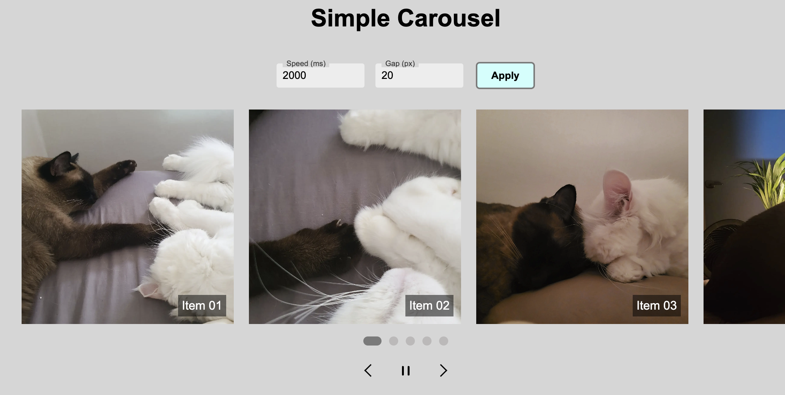
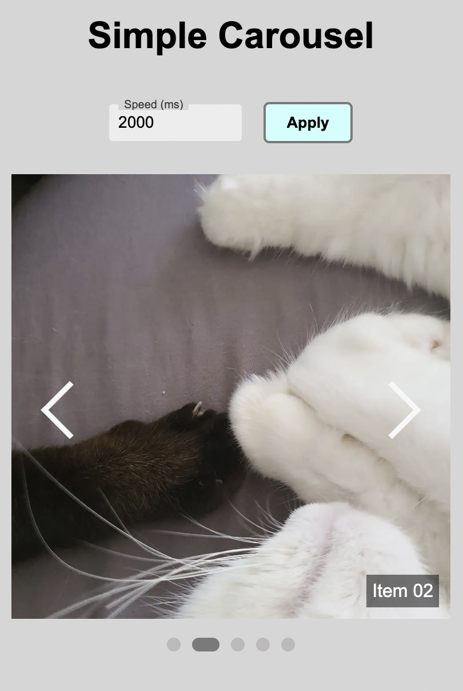

## Simple Carousel

JavaScript, HTML, CSS를 사용한 캐러셀 슬라이더</br>
자동 슬라이드, 터치 스와이프 내비게이션, 속도 및 간격 조정, 동적 인디케이터 생성 등의 기능을 구현

|  |  |
| :-----------------------------: | :-----------------------------: |

<br />

### 주요 기능

- **자동 슬라이드**: 사용자 지정 속도로 이미지를 자동 슬라이드 (재생/멈춤)
- **수동 슬라이드**: 이전 및 다음 버튼을 클릭하여 이미지를 수동으로 슬라이드
- **터치 스와이프**: 모바일 기기에서 스와이프 제스처를 통해 슬라이드를 전환
- **속도 및 간격 조정**: 슬라이드 전환 속도(ms, 기본값 2000ms) 및 슬라이드 간격(px, 기본값 20px) 설정. 단, 모바일 화면의 경우 간격 설정 숨김 처리함
- **인디케이터**: 현재 슬라이드 위치를 표시하는 동적 인디케이터 생성. 인디케이터 클릭 시 해당 슬라이드로 이동

<br />

### 설치 및 실행 방법

```bash
git clone https://github.com/username/repository.git

yarn
yarn start
```

<br />

### 프로젝트 구조


```
├─ img
│  ├─ favicon
├─ css
├─ js
│  └─ carousel.ts 
├─ index.html
├─ tsconfig.json
├─ webpack.config.dev.js
├─ webpack.config.prod.js
├─ package.json
├─ .gitignore
├─ .prettierrc.json
└─ yarn.lock

```